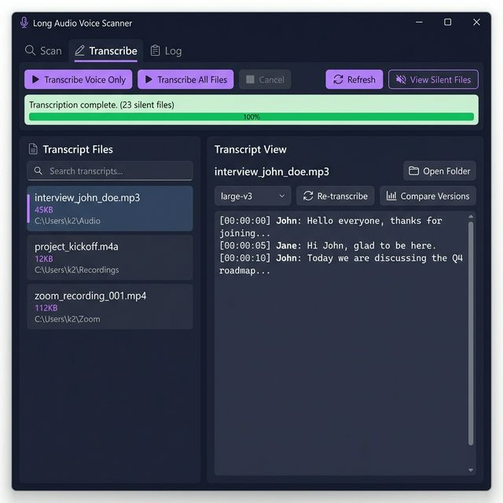

# 🎙️ TurboScribe Private

**GPU-accelerated batch voice scanner & transcription tool** for large media libraries.  
Uses [faster-whisper](https://github.com/SYSTRAN/faster-whisper) (CTranslate2) with GPU support for fast, accurate transcription.



## 📥 Download

**[⬇️ Download v1.3.1 (TurboScribe Private)](https://github.com/dparksports/mylongaudio/releases/download/v1.3.1/TurboScribePrivate-v1.3.1-win-x64.zip)** (Requires [.NET 8 Runtime](https://dotnet.microsoft.com/download/dotnet/8.0))

## ✨ Features

- **Voice Detection Scan** — Quickly scan directories for media files containing voice/speech using `silero-vad`
- **Batch Transcribe** — Transcribe all detected voice segments or entire directories with one click
- **Live Progress** — Real-time updates as each file is processed; view completed transcripts immediately
- **Model Selection** — Choose Whisper model size (`tiny.en` → `large-v3`) for speed vs accuracy tradeoff
- **Multi-Version Transcripts** — Re-transcribe files with different models; each version saved as `_transcript_{model}.txt`
- **Compare Versions** — Color-coded diff view to compare transcript versions side by side (🔴 red / 🟢 green highlighting)
- **Transcript Search** — Search across all transcripts by keyword with relevance scoring
- **Dark Theme WPF UI** — Modern Windows desktop app with tabbed interface
- **GA4 Analytics** — Session-aware telemetry with persistent client_id
- **Silent File Tracking** — Detects and lists metadata-only/silent files (viewable list)
- **Explorer Integration** — Right-click transcripts to Open File or Open Folder

## 🛠️ Tech Stack

| Component | Technology |
|-----------|------------|
| Transcription Engine | [faster-whisper](https://github.com/SYSTRAN/faster-whisper) (large-v3, GPU) |
| Voice Detection | Silero VAD |
| Desktop App | WPF (.NET 8, C#) |
| GPU Acceleration | CUDA via CTranslate2 |

## 🚀 Getting Started

### Prerequisites

- Windows 10/11
- Python 3.10+ with CUDA support
- .NET 8 SDK
- NVIDIA GPU with CUDA (recommended)

### Setup

```bash
# 1. Clone the repo
git clone https://github.com/dparksports/mylongaudio.git
cd mylongaudio

# 2. Create Python environment
python -m venv longaudio
longaudio\Scripts\activate

# 3. Install Python dependencies
pip install faster-whisper torch

# 4. Build the WPF app
dotnet build LongAudioApp\LongAudioApp.csproj

# 5. Run
dotnet run --project LongAudioApp
```

### Usage

1. **Scan Tab** — Set directory path, click **Start Scan** to detect voice in media files
2. **Transcribe Tab** — Use **Transcribe Voice Only** (scan-based) or **Transcribe All Files** (no scan needed)
3. **Search** — Type keywords in the search box and press Enter to find across all transcripts
4. **Re-transcribe** — Select a transcript, pick a model from the dropdown, click **🔄 Re-transcribe**
5. **Compare** — After re-transcribing with a different model, click **📊 Compare** to see a color-coded diff

## 📁 Project Structure

```
mylongaudio/
├── fast_engine.py              # Python transcription engine (7 modes)
├── LongAudioApp/               # WPF desktop application
│   ├── MainWindow.xaml          # UI layout (dark theme)
│   ├── MainWindow.xaml.cs       # Application logic
│   ├── PythonRunner.cs          # Python subprocess manager
│   ├── AnalyticsService.cs      # GA4 Measurement Protocol
│   └── ScanResult.cs            # Data models
├── setup_env.bat               # Environment setup script
└── LICENSE                     # Apache 2.0
```

## 📋 Transcription Modes

| Mode | Description |
|------|-------------|
| `scan` | Detect voice segments in a single file |
| `batch_scan` | Scan all media in a directory |
| `transcribe` | Transcribe a specific time range |
| `batch_transcribe` | Transcribe all detected voice segments |
| `batch_transcribe_dir` | Transcribe all files in directory (no scan needed) |
| `transcribe_file` | Full-file transcription with model selection |
| `search_transcripts` | Search across all transcript files |

## 📄 License

Licensed under the [Apache License 2.0](LICENSE).
