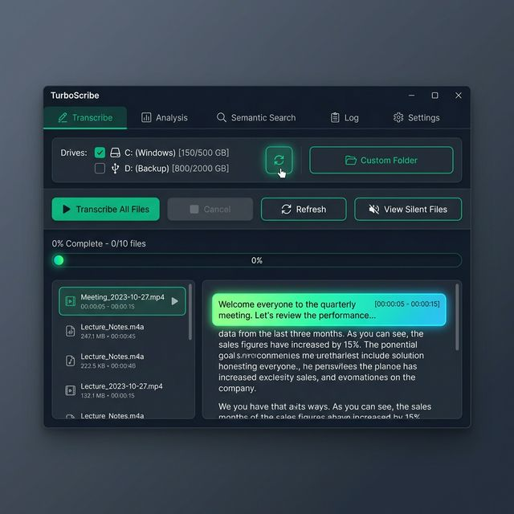

# 🎙️ TurboScribe

**Transcribe entire drives of audio and video — locally, privately, and for free.**

TurboScribe is a GPU-accelerated desktop app that uses **[faster-whisper](https://github.com/SYSTRAN/faster-whisper)** — a CTranslate2-powered engine that runs **up to 4x faster** than standard Whisper — to transcribe meetings, interviews, voice memos, and lectures entirely on your machine. Choose from multiple Whisper models (tiny, base, small, medium, large-v3, turbo) depending on your speed/accuracy needs. No cloud. No subscriptions. No data ever leaves your computer.

> 🌟 **Exceptional Noise Handling** — Works great with noisy outdoor recordings: car traffic, wind, lawn mowers, barking dogs.

---

## 📥 Download

**[⬇ Download TurboScribe v1.6.0 (Windows x64)](https://github.com/dparksports/turboscribe/releases/download/v1.6.0/TurboScribe-v1.6.0.zip)**

Extract the zip → run `TurboScribe.exe` → done.

**Requires:** Windows 10/11, NVIDIA GPU with CUDA. Python is installed automatically on first launch.

---

## 📸 Screenshot



---

## Why TurboScribe?

| | |
|---|---|
| 🔒 **100% Private** | All processing stays on your machine. Nothing is uploaded anywhere. |
| 💾 **Drive Selector** | Check entire drives (local, USB, network) and transcribe everything at once. |
| ⚡ **Up to 4x Faster** | GPU-accelerated via [faster-whisper](https://github.com/SYSTRAN/faster-whisper) and CTranslate2 — way faster than standard Whisper. |
| 🎛️ **Multiple Models** | Choose from tiny, base, small, medium, large-v3, or turbo. Re-transcribe and compare versions side-by-side. |
| 🔎 **Search Everything** | Keyword search + semantic search across all your transcripts. |
| 📝 **AI Summaries** | Summarize or outline any transcript — inline in the Analysis tab, or via right-click. Local or cloud LLMs. |
| 🆓 **Free & Open Source** | No limits, no subscriptions, fully auditable code. |

---

## 🚀 Quick Start

1. Download and extract the [latest release](https://github.com/dparksports/turboscribe/releases/latest)
2. Run `TurboScribe.exe`
3. Go to **Settings → Install AI Libraries** (one-time setup)
4. Check the drives you want to scan
5. Click **▶ Transcribe All Files**

### Build from Source

```bash
git clone https://github.com/dparksports/turboscribe.git
cd turboscribe
dotnet run --project LongAudioApp
```

---

## 🛠️ Tech Stack

| Component | Technology |
|---|---|
| Transcription | [faster-whisper](https://github.com/SYSTRAN/faster-whisper) (tiny → large-v3, turbo, CUDA) |
| Voice Detection | Silero VAD |
| Semantic Search | sentence-transformers |
| AI Analysis | Local (Phi-3, LLaMA) or Cloud (Gemini, OpenAI, Claude) |
| Desktop App | WPF, .NET 8, C# |

---

## 📄 License

[Apache License 2.0](LICENSE)
